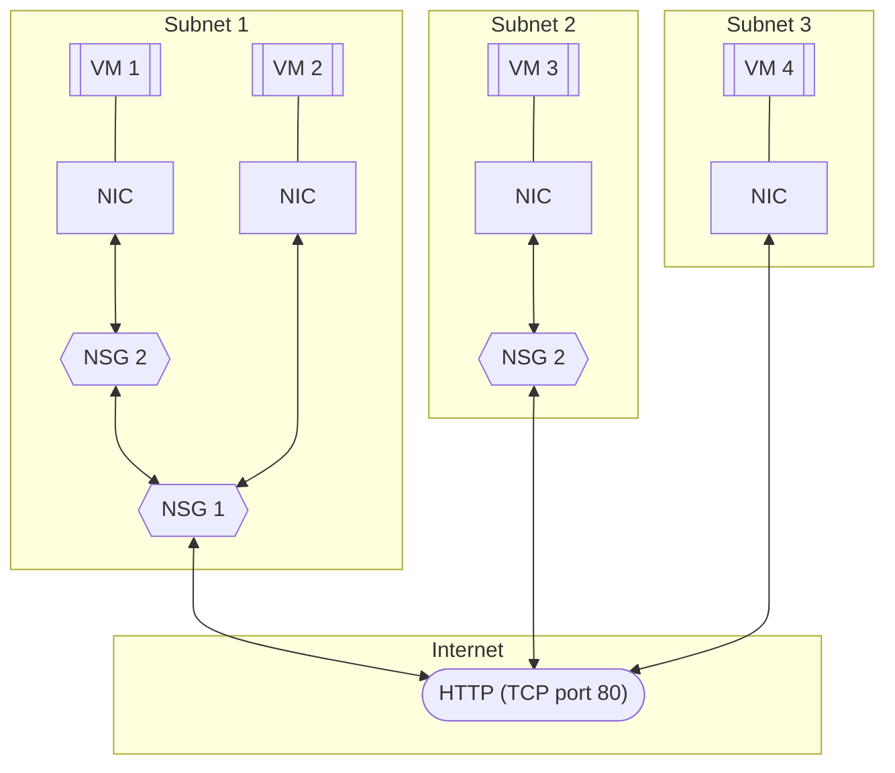
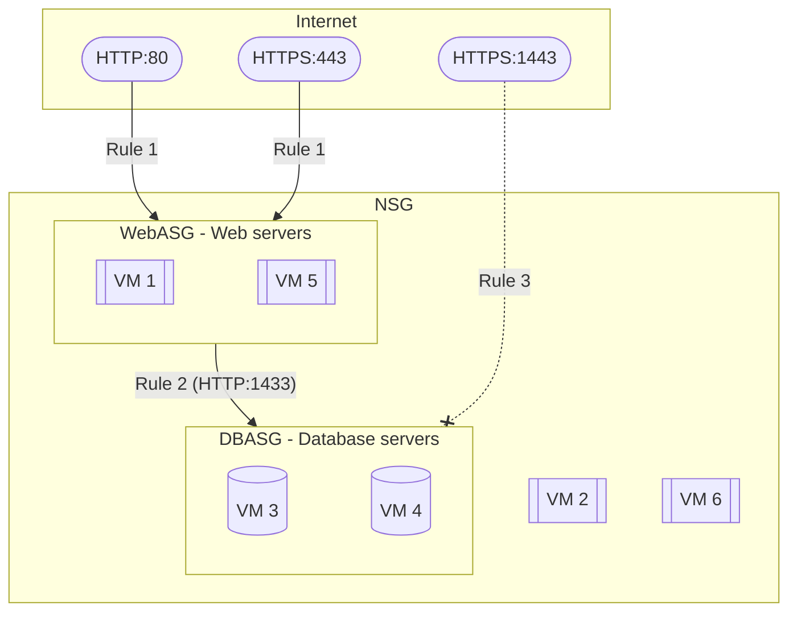

# [Network Security Groups](https://learn.microsoft.com/en-us/training/modules/configure-network-security-groups/)

You can limit network traffic to resources in your virtual network by using a network security group. You can assign a network security group to a subnet or a network interface, and define security rules in the group to control network traffic.

## Things to Know About Network Security Groups

* A network security group contains a list of security rules that allow or deny inbound or outbound network traffic.

* A network security group can be associated to a subnet or a network interface.

* A network security group can be associated multiple times.

* You create a network security group and define security rules in the Azure portal.

You can assign network security groups to a subnet and create a protected screened subnet (also referred to as a demilitarized zone or *DMZ*). A DMZ acts as a buffer between resources within your virtual network and the internet.

* Use the network security group to restrict traffic flow to all machines that reside within the subnet.

* Each subnet can have a maximum of one associated network security group.

You can assign network security gruops to a network interface card (NIC).

* Define network security group rules to control all traffic that flows through a NIC.

* Each network interface that exists in a subnet can have zero, or one, associated network security groups.

## Things to Know About Network Security Rules

Security rules in network security groups enable you to filter network traffic. You can define rules to control the traffic flow in and out of virtual network subnets and network interfaces.

* Azure creates several default security rules within each network security group, including inbound traffic and outbound traffic. Examples of default rules include `DenyAllInbound` traffic and `AllowInternetOutbound` traffic.

* Azure creates the default security rules in each network security group that you create.

* You can add more security rules to a network security group by specifying conditions for any of the following settings:

    * Name
    * Priority
    * Port
    * Protocol (Any, TCP, UDP)
    * Source (Any, IP addresses, Service tag)
    * Destination (Any, IP addresses, Virtual network)
    * Action (Allow or Deny)
    
* Each security rule is assigned a Priority value. All security rules for a network security group are processed in priority order. When a rule has a low Priority value, the rule has a higher priority or precedence in terms of order processing.

* You can't remove the default security rules.

* You can override a default security rule by creating another security rule that has a higher Priority setting for your network security group.

### Inbound Traffic Rules

Azure defines three default inbound security rules for your network security group. These rules **deny all inound traffic** except traffic from your virtual network and Azure load balancers. The following shows the default inbound security rules for a network security group in the Azure portal:

Priority | Name | Port | Protocol | Source | Destination | Action
---------|------|------|----------|--------|-------------|-------
65000 | AllowVnetInBound | Any | Any | VirtualNetwork | VirtualNetwork | Allow
65001 | AllowAzureLoadBalancerInBound | Any | Any | AzureLoadBalancer | Any | Allow
65500 | DenyAllInBound | Any | Any | Any | Any | Deny

### Outbound Traffic Rules

Azure defines three default outbound security rules for your network security group. These rules **only allow outbound traffic** to the internet and your virtual network. The following shows the default outbound security rules for a network security group in the Azure portal:

Priority | Name | Port | Protocol | Source | Destination | Action
---------|------|------|----------|--------|-------------|-------
65000 | AllowVnetOutBound | Any | Any | VirtualNetwork | VirtualNetwork | Allow
65001 | AllowInternetOutBound | Any | Any | Any | Internet | Allow
65500 | DenyAllOutBound | Any | Any | Any | Any | Deny

## Things to Know About Effective Security Rules

Each network security group and its defined security rules are evaluated independently. Azure processes the conditions in each rule defined for each virtual machine in your configuration.

* For inbound traffic, Azure first processes network security group security rules for any associated subnets and then any associated network interfaces.

* For outbound traffic, the process is reversed. Azure first evaluates network security group rules for any assocaited network interfaces followed by any associated subnets.

* For both the inbound and outbound evaluation process, Azure also checks how to apply the rules for intra-subnet traffic.

How Azure ends up applying your security rules for a virtual machine determines the overall *effectiveness* of your rules.

Consider teh following virtual network configuration that shows network security groups (NSGs) controlling traffic to virtual machines (VMs). The configuration requires security rules to manage network traffic to and from the internet over TCP port 80 via the network interface.

In this virtual network configuration, there are three subnets. **Subnet 1** contains two virtual machines: **VM 1** and **VM 2**. **Subnet 2** and **Subnet 3** each contain one virtual machine: **VM 3** and **VM 4**, respectively. Each VM has a network interface card (NIC).

Azure evaluates each NSG configuration to determine the effective security rules:

Evaluation | Subnet NSG | NIC NSG | Inbound rules | Outbound rules
-----------|------------|---------|---------------|---------------
VM 1 | Subnet 1 NSG 1 | NIC NSG 2 | NSG 1 subnet rules have precedence over NSG 2 NIC rules | NSG 2 NIC rules have precedence over NSG 1 subnet rules
VM 2 | Subnet 1 NSG 1 | NIC none | NSG 1 subnet rules apply to both subnet and NIC | Azure default rules apply to NIC and NSG 1 subnet rules apply to subnet only
VM 3 | Subnet 2 none | NIC NSG 2 | Azure default rules apply to subnet and NSG 2 rules apply to NIC | NSG 2 NIC rules apply to NIC and subnet
VM 4 | Subnet 3 none | NIC none | Azure default rules apply to both subnet and NIC and all inboud traffic is allowed | Azure default reuls apply to both subnet and NIC and all outbound traffic is allowed

### Inbound Traffic Effective Rules

Azure processes rules for inbound traffic for all VMs in the configuration. Azure identifies if the VMs are members of an NSG, and if they have an associated subnet or NIC.

* When an NSG is created, Azure creates the default security rule `DenyAllInbound` for the group. The default behavior is to deny all inbound traffic from the internet. If an NSG has a subnet or NIC, the rules for the subnet or NIC can override the default Azure security rules.

* NSG inbound rules for a subnet in a VM take precedence over NSG inbound rules for a NIC in the same VM.

### Outbound Traffice Effective Rules

Azure processes rules for outbound traffic by first examining NSG associations for NICs in all VMs.

* When an NSG is created, Azure creates the default security rule `AllowInternetOutbound` for the group. The default behavior is to allow all outbound traffic to the internet. If an NSG has a subnet or NIC, the rules for the subnet or NIC can override the default Azure security rules.

* NSG outbound rules for a NIC in a VM take precedence over NSG outbound rules for a subnet in the same VM.

## Things to Consider When Creating Effective Rules

* **Consider allowing all traffic.** If you place your virtual machine within a subnet or utilize a network interface, you don't have to associate the subnet or NIC with a security group. This apporach allows all network traffic through the subnet or NIC according to the default Azure security rules. If you're not concerned about controlling traffic to your resource at a specific level, then don't associate your resource at that level to a network security group.

* **Consider importance of allow rules.** When you create a network security group, you must define an **allow** rule for both the subnet and network interface in the group to ensure traffic can get through. If you have a subnet or NIC in your network security group, you must define an allow rule at each level. Otherwise, the traffic is denied for any level that doesn't provide an allow rule definition.

* **Consider intra-subnet traffic.** The security rules for a network security group that's associated to a subnet can affect traffic between all virtual machines in the subnet. By default, Azure allows virtual machines in the same subnet to send traffic to each other (referred to as *intra-subnet traffic*). You can prohibit intra-subnet traffic by defining a rule in the network security gruop to deny all inbound and outbound traffic. This rule prevents all virtual machines in your subnet from cmomunicating with each other.

* **Consider rule priority.** The security rules for a network security group are processed in priority order. To ensure a particular security rule is always processed, assign the lowest possible priority value to the rule. It's a good practice to leave gaps in your priority numbering, such as 100, 200, 300, and so on. The gaps in the numbering allow you to add new rules wtihout having to edit existing rules.

### View Effective Security Rules

If you have several network security groups and aren't sure which security rules are being applied, you can use the **Effective security rules** link in the Azure portal. You can use the link to verify which security rules are applied to your machine, subnets, and network interfaces.

## Things to Know About Configuring Security Rules

It's easy to add security rules to control inbound and outbound traffic in the Azure portal. You can configure your virtual network security group rule settings, and select from a large variety of cmmunication services, including HTTPS, RDP, FTP, and DNS.

* **Source:** Identifies how the security rule controls **inbound** traffic. The value specifies a specific source IP address range that's allowed or denied. The source filter can be any resource, an IP address range, an application security group, or a default tag.

* **Destination:** Identifies how the security rule controls **outbound** traffic. The value specifies a specific destination IP address range that's allowed or denied. The destination filter value is similar to the source filter. The valu can be any resource, an IP address range, an application security group, or a default tag.

* **Service:** Specifies the destination protocol and port range for the security rule. You can choose a predefined service like RDP or SSH or provide a custom port range. There are a large number of services to select from.

* **Priority:** Assigns the priority order value for the security rule. Rules are processed according to the priority order of all rules for a network security group, including a subnet and network interface. The lower the priority value, the higher priority for the rule.

## Things to Know About Using Application Security Groups

You can implement application security groups in your Azure virtual network to logically group your virtual machines by workload. You can tehn define your networks security group rules based on your application security groups.

Application security groups work in the same way as network security groups, but they provide an application-centric way of looking at your infrastructure. You join your virtual machines to an application security group. Then you use the application security group as a source or destination in the network security group rules.

### Scenario Requirements

Here are the excenario requirements for the above configuration:

* Six virtual machines with two web servers and two database servers.

* Customers access the online catalog hosted on the web servers.

* Web servers must be accessible from the internet over HTTP port 80 and HTTPS port 443.

* Inventory information is stored on database servers.

* The database servers must be accessible over HTTPS port 1433.

* Only the web servers should have access to the database servers.

### Solution

1. Create application security groups for the virtual machines.

    a. Create an application security group named `WebASG` to group web servers.

    b. Create an application security group named `DBASG` to group database server machines.

2. Assign the network interfaces for the virtual machines.

    * For each virtual machine server, assign its NIC to the appropriate application security group.

3. Create the network security group and security rules.

    * **Rule 1:** Set **Priority** to 100. Allow access to the internet to machines in the `WebASG` group from HTTP port 80 and HTTPS port 443.

        Rule 1 has the lowest priority value, so it has prcedence over the other rules in the group. Customer access to the online catalog is paramount to the design.

    * **Rule 2:** Set **Priority** to 110. Allow access from machines in the `WebASG` group to machines in the `DBASG` group over HTTPS port 1433.

    * **Rule 3:** Set **Priority** to 120. **Deny** (X) access from anywhere to machines in the `DBASG` group over HTTPS port 1433.

        The combinatino of Rule 2 and Rule 3 ensures that only web servers can access the database servers. This security configuration protected inventory databases from outside attack.

## Things to Consider When Using Application Security Groups

There are several advantages to implementing application security groups in your virtual networks.

* **Consider IP address maintenance.** When you control network traffic by using application security gruops, you don't need to configure inbound and outbound traffic for specific IP addresses. If you have many virtual machines in your configuration, it can be difficult to specify all of the affected IP addresses. As you maintain your configuration, the number of your servers can change. These changes can require you to modify how you support different IP addresses in your security rules.

* **Consider no subnets.** By organizing your virtual machines into application security gruops, you don't need to also distribute your servers across specific subnets. You can arrange your servers by application and purpose to achieve logical groupings.

* **Consider simplified rules.** Application security gruops help to eliminate the need for multiple rule sets. You don't need to create a separate rule for each virtual machine. You can dynamically apply new rules to designated application security groups. New security rules are automatically applied to all the virtual machines in the specified application security group.

* **Consider workload support.** A configuration that ipmlements application security groups is easy to maintain and understand because the organization is based on workload usage. Application security groups provide logical arrangements for your applications, services, data storage, and workloads.