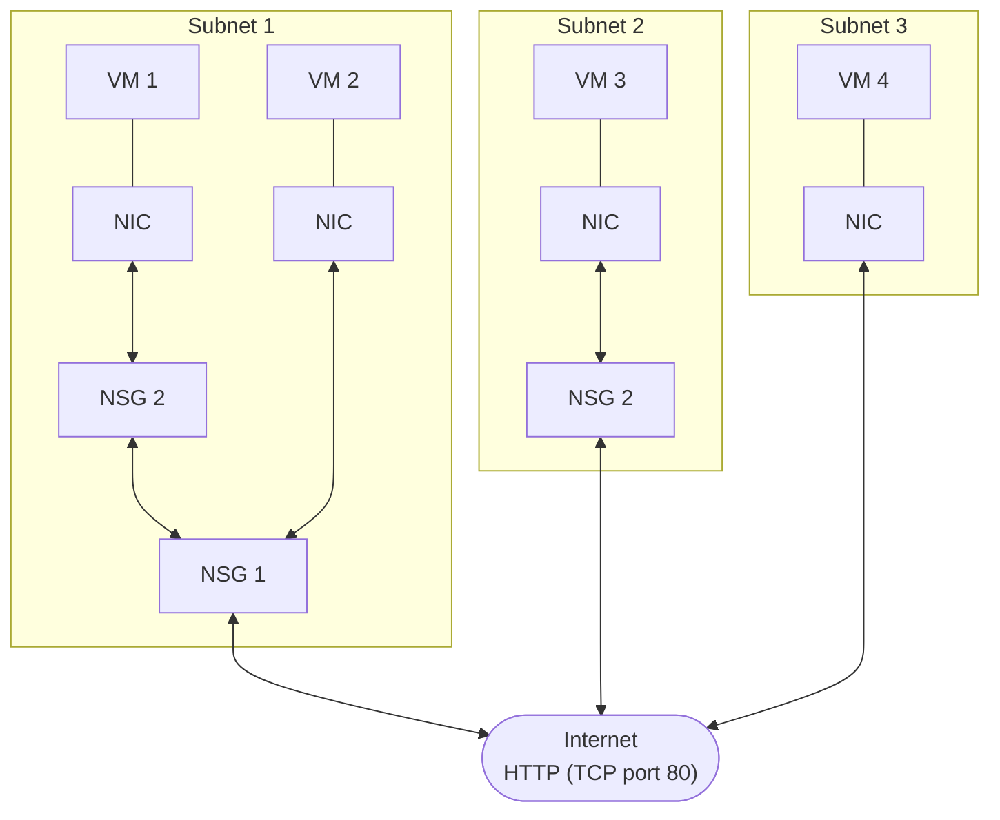

# Network Security Groups

You can limit network traffic to resources in your virtual network by using a network security group. You can assign a network security group to a subnet or a network interface, and define security rules in the group to control network traffic.

## Things to Know About Network Security Groups

* A network security group contains a list of security rules that allow or deny inbound or outbound network traffic.

* A network security group can be associated to a subnet or a network interface.

* A network security group can be associated multiple times.

* You create a network security group and define security rules in the Azure portal.

You can assign network security groups to a subnet and create a protected screened subnet (also referred to as a demilitarized zone or *DMZ*). A DMZ acts as a buffer between resources within your virtual network and the internet.

* Use the network security group to restrict traffic flow to all machines that reside within the subnet.

* Each subnet can have a maximum of one associated network security group.

You can assign network security gruops to a network interface card (NIC).

* Define network security group rules to control all traffic that flows through a NIC.

* Each network interface that exists in a subnet can have zero, or one, associated network security groups.

## Things to Know About Network Security Rules

Security rules in network security groups enable you to filter network traffic. You can define rules to control the traffic flow in and out of virtual network subnets and network interfaces.

* Azure creates several default security rules within each network security group, including inbound traffic and outbound traffic. Examples of default rules include `DenyAllInbound` traffic and `AllowInternetOutbound` traffic.

* Azure creates the default security rules in each network security group that you create.

* You can add more security rules to a network security group by specifying conditions for any of the following settings:

    * Name
    * Priority
    * Port
    * Protocol (Any, TCP, UDP)
    * Source (Any, IP addresses, Service tag)
    * Destination (Any, IP addresses, Virtual network)
    * Action (Allow or Deny)
    
* Each security rule is assigned a Priority value. All security rules for a network security group are processed in priority order. When a rule has a low Priority value, the rule has a higher priority or precedence in terms of order processing.

* You can't remove the default security rules.

* You can override a default security rule by creating another security rule that has a higher Priority setting for your network security group.

### Inbound Traffic Rules

Azure defines three default inbound security rules for your network security group. These rules **deny all inound traffic** except traffic from your virtual network and Azure load balancers. The following shows the default inbound security rules for a network security group in the Azure portal:

Priority | Name | Port | Protocol | Source | Destination | Action
---------|------|------|----------|--------|-------------|-------
65000 | AllowVnetInBound | Any | Any | VirtualNetwork | VirtualNetwork | Allow
65001 | AllowAzureLoadBalancerInBound | Any | Any | AzureLoadBalancer | Any | Allow
65500 | DenyAllInBound | Any | Any | Any | Any | Deny

### Outbound Traffic Rules

Azure defines three default outbound security rules for your network security group. These rules **only allow outbound traffic** to the internet and your virtual network. The following shows the default outbound security rules for a network security group in the Azure portal:

Priority | Name | Port | Protocol | Source | Destination | Action
---------|------|------|----------|--------|-------------|-------
65000 | AllowVnetOutBound | Any | Any | VirtualNetwork | VirtualNetwork | Allow
65001 | AllowInternetOutBound | Any | Any | Any | Internet | Allow
65500 | DenyAllOutBound | Any | Any | Any | Any | Deny

## Things to Know About Effective Security Rules

Each network security group and its defined security rules are evaluated independently. Azure processes the conditions in each rule defined for each virtual machine in your configuration.

* For inbound traffic, Azure first processes network security group security rules for any associated subnets and then any associated network interfaces.

* For outbound traffic, the process is reversed. Azure first evaluates network security group rules for any assocaited network interfaces followed by any associated subnets.

* For both the inbound and outbound evaluation process, Azure also checks how to apply the rules for intra-subnet traffic.

How Azure ends up applying your security rules for a virtual machine determines the overall *effectiveness* of your rules.

Consider teh following virtual network configuration that shows network security groups (NSGs) controlling traffic to virtual machines (VMs). The configuration requires security rules to manage network traffic to and from the internet over TCP port 80 via the network interface.

In this virtual network configuration, there are three subnets. **Subnet 1** contains two virtual machines: **VM 1** and **VM 2**. **Subnet 2** and **Subnet 3** each contain one virtual machine: **VM 3** and **VM 4**, respectively. Each VM has a network interface card (NIC).

Azure evaluates each NSG configuration to determine the effective security rules:

Evaluation | Subnet NSG | NIC NSG | Inbound rules | Outbound rules
-----------|------------|---------|---------------|---------------
VM 1 | Subnet 1 NSG 1 | NIC NSG 2 | NSG 1 subnet rules have precedence over NSG 2 NIC rules | NSG 2 NIC rules have precedence over NSG 1 subnet rules
VM 2 | Subnet 1 NSG 1 | NIC none | NSG 1 subnet rules apply to both subnet and NIC | Azure default rules apply to NIC and NSG 1 subnet rules apply to subnet only
VM 3 | Subnet 2 none | NIC NSG 2 | Azure default rules apply to subnet and NSG 2 rules apply to NIC | NSG 2 NIC rules apply to NIC and subnet
VM 4 | Subnet 3 none | NIC none | Azure default rules apply to both subnet and NIC and all inboud traffic is allowed | Azure default reuls apply to both subnet and NIC and all outbound traffic is allowed